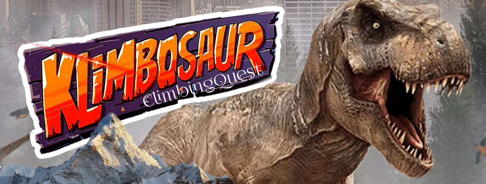

Long ago, when dinosaurs ruled cliffs and clouds, one raptor named Rex dreamed of reaching the top with his best friend, Spike.

But just before the final ascent…
Disaster. Their climbing gear scattered by a swarm of wild pterodactyls.

Now, Rex must race across molten caves, ice-cracked ridges, and lost jungle ruins to recover every last piece.

## 🕹️ How to Play ##

1. **Build the game**:

make
   
2. **Run the game with a map**:

./so_long maps/<map_name>.ber

/*Use one of the maps in the maps/ directory or provide your own .ber file.*/

## 🗺️ Map Rules

To create your own map, simply make a `.ber` file following these rules:

- File must end with `.ber`.
- Allowed characters:
  - `1` – Wall  
  - `0` – Empty space  
  - `C` – Collectible  
  - `E` – Exit  
  - `P` – Player
- The map must be:
  - **Rectangular** (all lines the same length)
  - **Fully enclosed by walls**
  - Contain **exactly 1 player (P)**
  - Contain **exactly 1 exit (E)**
  - Contain **at least 1 collectible (C)**

⚠️ Maps that don't follow these rules will not run.
